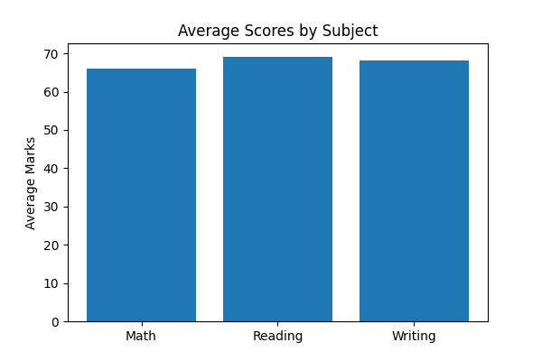
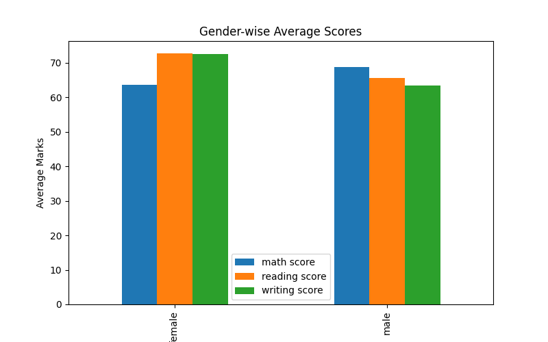
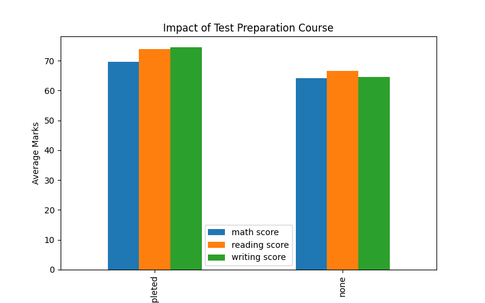
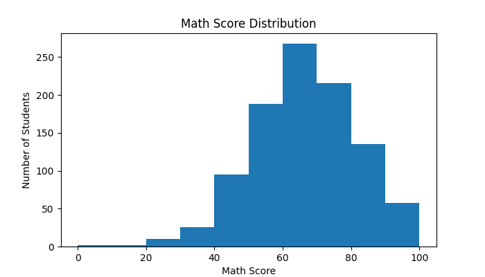

# 📊 Student Performance Analysis using Python

## Overview

This project performs Exploratory Data Analysis (EDA) on a student performance dataset using Python. The objective is to analyze academic performance trends and generate insights using data visualization techniques.

## Dataset

The dataset contains 1000 student records with the following attributes:

- Gender
- Race/Ethnicity
- Parental Level of Education
- Lunch Type
- Test Preparation Course
- Math Score
- Reading Score
- Writing Score

## Technologies Used

- Python
- Pandas
- Matplotlib

## Analysis Performed

### Dataset Exploration
- Dataset shape and structure
- Column analysis

### Performance Analysis
- Average Math Score
- Average Reading Score
- Average Writing Score

### Gender-wise Analysis
- Comparison of student performance by gender

### Test Preparation Analysis
- Impact of completing a test preparation course

### Data Visualization
- Subject Average Scores
- Gender-wise Performance Comparison
- Test Preparation Impact
- Math Score Distribution

## Visualizations

### Average Scores by Subject



### Gender-wise Performance



### Impact of Test Preparation



### Math Score Distribution



## Key Findings

- Average Math Score: 66.09
- Average Reading Score: 69.17
- Average Writing Score: 68.05
- Female students performed better in Reading and Writing.
- Male students performed better in Mathematics.
- Students who completed the test preparation course achieved higher scores across all subjects.

## Project Structure

```
student-performance-analysis
│
├── data
│   └── StudentsPerformance.csv
│
├── charts
│   ├── subject_average.png
│   ├── gender_performance.png
│   ├── test_prep_impact.png
│   └── math_distribution.png
│
├── analysis.py
├── README.md
└── Student_Performance_Analysis_Report.docx
```

## How to Run

```bash
pip install pandas matplotlib
python analysis.py
```

## Author

**Kanneboina Maheshwari**  
Artificial Intelligence Intern  
The Entrepreneurship Network (TEN)